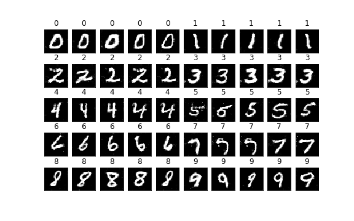

# RobustClassifier
Classifier trained along with Wasserstein GAN to make it robust to adversarial examples 

------
A neural network classifier made robust to adversarial examples using Generative Adversarial Network (GAN).

## Requirements
- Python 3
- Numpy
- Tensorflow 1.0
- Open CV - Python

## Dataset Used
MNIST Dataset hosted on [Yann LeCun's website](http://yann.lecun.com/exdb/mnist/)

## Instructions
Training the Classical DNN Model  

`python robust_classifier.py -train y`

Testing the Classical DNN Model against MNIST Dataset  

`python robust_classifier.py -test y`

Testing the Classical DNN Model against the Generated Image  

`python robust_classifier.py -rd /model -pd /data -test y -gen y`

Training the Robust Classfier using Wasserstein GAN  

`python robust_classifier.py -m wgan -train y -e 30000`

The GAN is quickly able to create near to original image in 20000 epochs. But to get a better image generation the epochs can be taken as 30000

Generate images using saved model, assuming that the model is saved in "/input" directory  

`python robust_classifier.py -m wgan -rd /input -pd /input -gen y`

Testing the Robust Classifier against the Generated Image  

`python robust_classifier.py -m wgan -rd /model -pd /data -test y -gen y`  

The arguments used by the program are as follows  

- `-m` - Defines the type of model, (Classical: mnist, GAN: wgan) default is 'mnist'
- `-rd` - Defines the location from where the model is to be taken, the saved checkpoint of the model, default is '/input'
- `-wd` - Defines the location where the output is to be written, default is '/output'
- `-pd` - Defines where the generated images are saved for testing, default is '/input'
- `-pf` - Defines the file name of the generated images file, default is 'None'
- `-train` - Defines the different operation if set to a value the model will be trained, default is blank indicating no training
- `-test` - Defines the different operation if set to a value the model will be tested, default is blank indicating no testing
- `-gen` - Defines the different operation if set to a value the model will be generate image or use it, default is blank indicating generating
- `-e` - to set the number of epochs for training the model, default is '200'
- `-sim` - to save images or not, default is blank indicating no saving of images

## Images generated
The image generated after final training of the GAN Model.

It is a near to original image generation with conditions on the different classes arragned vertically

## Inspired by
[Generative adversarial network based adversarial examples generation and defense] (http://cs229.stanford.edu/proj2016/report/LiuXia-AdversarialExamplesGenerationAndDefenseBasedOnGenerativeAdversarialNetwork-report.pdf)  
by Fei Xia, Ruishan Liu 
[Github] (https://github.com/fxia22/advGAN)

## Adaptation from
[Conditional WassersteinGAN with Auxiliary Classifier] (https://github.com/fairytale0011/Conditional-WassersteinGAN)  
[Improved WGAN] (https://github.com/igul222/improved_wgan_training)  
[Tensorflow Implementation of Wasserstein GAN (and Improved version in wgan_v2)] (https://github.com/jiamings/wgan)

## Trained Model logs and output links
[Classic Classifier Training log Link] (https://www.floydhub.com/api/v1/resources/wqnQUj8EoHEjmxUL2bWcGB?content=true)  
[Classic Classifier Output Link] (https://www.floydhub.com/api/v1/resources/cLgd79j9zEZJA7mWpQAJi6?content=true)   
[Robust Classifier Training log Link] (https://www.floydhub.com/api/v1/resources/Sng42B849k7f8rYffqqZRg?content=true)  
[Robust Classifier Output log Link] (https://www.floydhub.com/api/v1/resources/sPf4j6aJdUoHBvjpn6QVcR?content=true)  

